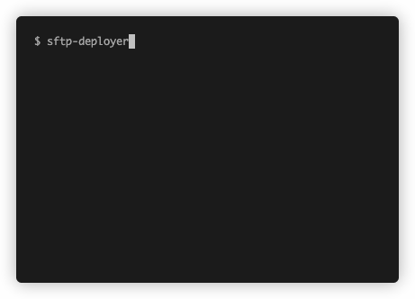

# sftp-deployer

The fastest SFTP deployer around.

- Transfers a directory as a single compressed file
- Minimizes downtime of target directory with [blue/green deployment](https://en.wikipedia.org/wiki/Blue-green_deployment)



## Install

You need Node.JS to use `sftp-deployer`.

```
npm install -g sftp-deployer
```

## Usage

The following command uploads the `./dir` directory to a remote SSH host, to `/var/www/uploads`:

```
sftp-deployer --host example.com \
  --user bob \
  --key private_key.pem \
  --local ./dir \
  --target /var/www/uploads
```

Available options:

```
  -V, --version                output the version number
  -h, --host <host>            hostname to connect to
  -p, --port <port>            SSH port to use (defaults to 22)
  -u, --user <username>        the ssh username
  -k, --key <key_or_file>      path to private key file, or private key itself
  -l, --local <path>           directory to upload
  -t, --target <target_dir>    target directory on remote host
  -s, --staging <staging_dir>  staging directory on remote host
                               (defaults to the target directory + .staging)
  -u, --upload <upload_dir>    upload directory on remote host (default: "/var/tmp")
  --help                       display help for command
```

## Using a configuration file

Each of the options listed above may also be specified in a configuration file called `.sftp.json`. For example:

```javascript
{
  "host": "example.com",
  "port": "1234", /* Optional, defaults to 22 */
  "user": "bob"
  "key": "private_key.pem"
  "local": "./dir",
  "target": "/var/www/uploads",
  "staging": "/var/www/incoming/uploads", /* Optional, defaults to target directory + .staging */
  "upload": "/my/upload/dir" /* Optional, defaults to /var/tmp */
}
```

You may then simply invoke `sftp-deployer` and it will take its input from the `.sftp.json` file in the current working directory.

## Blue/green deployment

When a directory is uploaded but a target directory already exists, the following steps are taken to minimize downtime:

- Deploy new directory to a staging location
- Swap staging location and target location

This makes sure that the target directory is only down for a couple of milliseconds.
